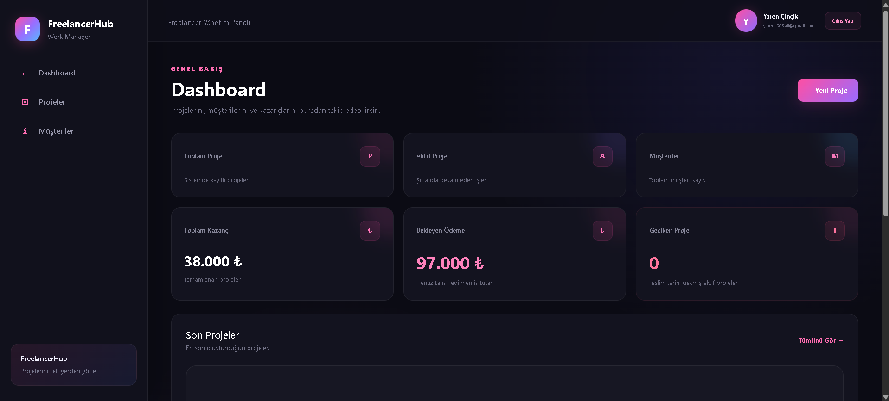
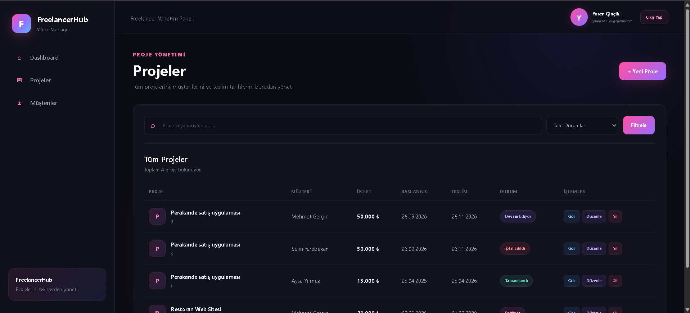
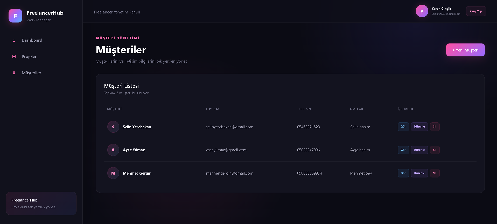

# FreelancerWorkTracker

A web-based freelancer project and customer management application built with ASP.NET Core MVC.

The application provides a simple workspace for freelancers to manage customers, track projects, monitor payments, and follow project deadlines.

## Features

- User registration and authentication
- Personal dashboard
- Customer management
- Project management
- Project status tracking
- Payment tracking
- Deadline management
- User-specific data management
- Responsive and modern interface

## Technologies

- ASP.NET Core MVC
- C#
- Entity Framework Core
- ASP.NET Core Identity
- SQLite
- HTML5
- CSS3
- Bootstrap

## Dashboard

The dashboard provides an overview of project activity, payment information, and current workload.

## Project Management

Projects can be created and associated with customers. Each project includes information such as price, collected payment, start date, deadline, and project status.

## Customer Management

Customer records can be created and managed with contact information and additional notes.

## Data Privacy

Application data is stored locally using SQLite. Local database files are excluded from the repository through `.gitignore`.

Each authenticated user can access only their own customer and project records.

## Project Structure

The application follows the MVC (Model-View-Controller) architecture:

- **Models** — Application data models
- **Views** — User interface
- **Controllers** — Application logic and request handling
- **ViewModels** — Data prepared specifically for views
- **Data** — Database context and configuration
- **Migrations** — Entity Framework Core database migrations
- **wwwroot** — Static assets such as CSS and JavaScript

## Running the Project

1. Clone the repository.
2. Open the solution in Visual Studio.
3. Restore the required NuGet packages.
4. Apply the Entity Framework Core migrations.
5. Run the application.

A local SQLite database will be created for development.

## Purpose

FreelancerWorkTracker was developed as a portfolio project to demonstrate practical experience with ASP.NET Core MVC, C#, Entity Framework Core, authentication, relational data management, and CRUD operations.

## Author

**Yaren Çinçik**

Computer Programming
